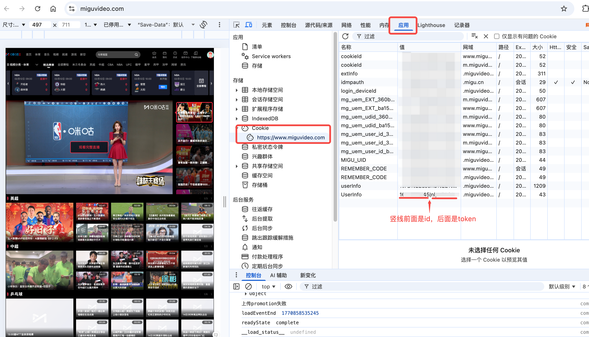
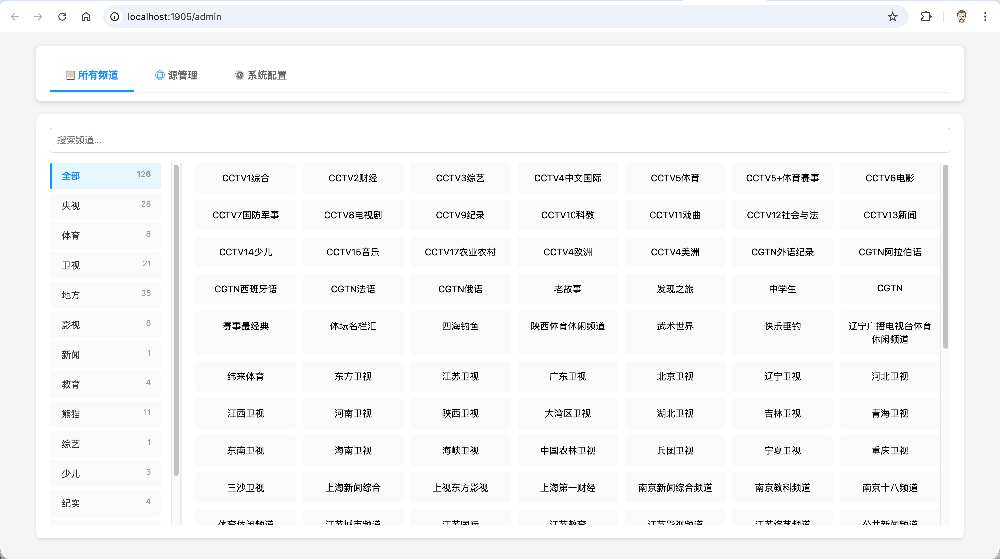
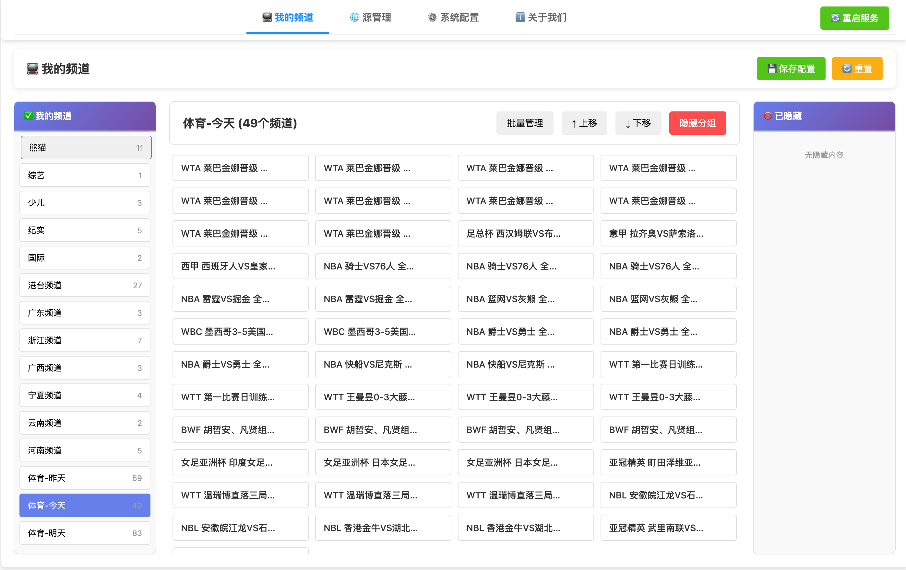

# iPTV

**当前版本：v1.1.1**

> 一个基于 Node.js 的 IPTV 直播源管理和分发系统，支持咪咕视频源抓取和外部直播源管理。

## 📖 项目简介

本项目提供完整的 IPTV 直播源解决方案，主要功能包括：

1. **📺 咪咕视频源抓取** - 自动获取咪咕视频的电视频道，包括 CCTV 和主要卫视频道（720P 高清画质）

2. **🎫 VIP 会员增强** - 配置开通相应会员的咪咕账号信息后，可抓取体育直播等会员频道（支持 1080P、蓝光或更高画质）

3. **🔗 外部源管理** - 支持添加外部 m3u8 直播链接，或通过网页播放地址自动抓取直播源

4. **🖥️ Web 管理后台** - 通过 `http://your-ip:1905/admin` 访问可视化管理平台，轻松管理所有直播源

📋 **详细功能说明和配置方法请参考下方文档**

---

## 🚀 快速开始 - Docker 部署（推荐）

### 使用 Docker Compose（最简单）

创建 `docker-compose.yml` 文件：

```yaml
services:
  iptv:
    image: akiralereal/iptv:latest              # 使用最新版本镜像
    container_name: iptv                        # 自定义容器名称
    ports:
      - "1905:1905"                             # 宿主机:容器端口映射
    environment:
      - muserId=                                # 可选：咪咕账号ID（留空为游客模式）
      - mtoken=                                 # 可选：咪咕登录令牌（用于高画质/VIP）
      - mport=1905                              # 必须：容器监听端口，与 ports 对应
      - mhost=                                  # 可选：外部访问地址（如 http://test.com:1905）
      - mrateType=4                             # 画质：2=标清，3=高清，4=蓝光(需VIP)
      - mpass=                                  # 可选：访问密码（设置后访问: http://ip:port/密码/...）
    restart: always                             # 容器异常退出后自动重启
```

启动服务：

```bash
docker-compose up -d
```

常用命令：

```bash
# 查看日志
docker-compose logs -f

# 停止服务
docker-compose down

# 重启服务
docker-compose restart

# 更新镜像
docker-compose pull && docker-compose up -d
```

### 使用 Docker 命令直接运行

#### 拉取镜像

```bash
docker pull akiralereal/iptv:latest
# 或指定版本
docker pull akiralereal/iptv:1.1.1
```

#### 快速运行（游客模式）

```bash
docker run -d -p 1905:1905 --name iptv akiralereal/iptv:latest
```

#### 自定义配置运行

```bash
docker run -d -p 1905:1905 \
  -e muserId=你的ID \
  -e mtoken=你的token \
  -e mport=1905 \
  -e mhost="http://192.168.1.100:1905" \
  -e mrateType=4 \
  -e mpass=mypassword \
  --name iptv \
  akiralereal/iptv:latest
```

### 🎯 访问服务

部署成功后，可以通过以下地址访问：

#### 📺 播放列表
- **M3U 格式**: `http://your-ip:1905/m3u`
- **TXT 格式**: `http://your-ip:1905/txt`
- **节目单（EPG）**: `http://your-ip:1905/playback.xml`

#### 🖥️ Web 管理后台（重要）

> [!TIP]
> **快速访问管理后台：**
> 
> - **无密码访问**: `http://your-ip:1905/admin`
> - **有密码访问**: `http://your-ip:1905/密码/admin`
> 
> 💡 *将 `your-ip` 替换为你的服务器IP地址，例如: `http://192.168.1.100:1905/admin`*

通过管理后台可以：
- ✅ 查看所有频道列表
- ✅ 添加/编辑/删除外部直播源
- ✅ 配置系统参数（画质、公网地址、访问密码等）
- ✅ 一键更新播放列表

---

## 📚 详细功能说明

### 核心功能

- ✅ **多种直播源支持**
  - 咪咕视频源（300+ 频道，含 CCTV、卫视、地方台）
  - 外部自定义直播源（m3u8 格式）
  
- ✅ **灵活的画质选择**
  - 标清 (480p) - 游客可用
  - 高清 (720p) - 游客可用
  - 蓝光 (1080p) - 需要 VIP
  - 原画 (1080p+) - 需要 VIP
  - 4K (2160p) - 需要 VIP
  
- ✅ **回看功能** - 支持当天节目回看
  
- ✅ **Web 管理后台**
  - 📺 自动抓取网页中的 m3u8 播放地址
  - 🔧 手动添加已知的播放地址
  - 🔄 支持独立自动刷新功能
  - ⚡ 快速模式：删除/修改源 1-2 秒内生效
  
- ✅ **自动更新节目单（EPG）** - 定时同步最新节目信息

---

## 🔧 本地部署（进阶用户）

### 前置要求

- Node.js 18+ 环境
- 中国大陆网络环境（访问咪咕频道）

### 注意事项

1. 登录后使用请注意账号安全
2. 咪咕频道需要中国大陆网络环境才可正常访问

### 使用模式

#### 🎯 游客模式（推荐，无需配置）

- ✅ 无需配置账号，开箱即用
- ✅ 支持所有普通频道（央视、卫视、地方台等）
- ✅ 支持回看功能
- ⚠️ 画质限制为 **720p**

#### 🎫 VIP 会员模式

- ✅ 支持高清及以上画质（1080p、蓝光、4K）
- ✅ 支持体育赛事等会员内容
- ⚠️ 需要配置 `muserId` 和 `mtoken`
- ⚠️ 需要咪咕视频 VIP 会员

> **提示**：登录普通账号（无VIP）与游客模式效果相同，都是 720p 画质。只有 VIP 会员才能观看高清及以上画质。

#### 📝 如何获取 userId 和 token

如需使用 VIP 会员功能，需要获取咪咕账号的 `userId` 和 `token`。

> [!IMPORTANT]
> **获取步骤：**
> 1. 使用浏览器访问 [咪咕视频官网](https://www.miguvideo.com/)
> 2. 登录你的咪咕 VIP 账号
> 3. 打开浏览器开发者工具（F12）
> 4. 切换到"网络"(Network) 标签
> 5. 刷新页面，在请求中找到包含认证信息的 API 请求
> 6. 从请求头或响应中提取 `userId` 和 `token` 参数

<div align="center">
  
  <p><i>浏览器开发者工具获取 userId 和 token 示例</i></p>
</div>

### 配置说明

| 变量名          | 默认值 | 类型    | 介绍                                                                                      |
| --------------- | ------ | ------- | ----------------------------------------------------------------------------------------- |
| muserId         |        | string  | 用户id（仅VIP用户需要配置）<br>可在网页端登录获取                                          |
| mtoken          |        | string  | 用户token（仅VIP用户需要配置）<br>可在网页端登录获取                                       |
| mport           | 1905   | number  | 本地运行端口号                                                                            |
| mhost           |        | string  | 公网/自定义访问地址<br>格式<http://ip:port>                                               |
| mrateType       | 3      | number  | 画质<br>2: 标清 (480p)<br>3: 高清 (720p)<br>4: 蓝光 (1080p，需VIP)<br>7: 原画 (1080p+，需VIP)<br>9: 4K (2160p，需VIP) |
| mpass           |        | string  | 访问密码 大小写字母和数字<br>添加后访问格式 <http://ip:port/mpass/>...                    |
                                           |

### 高级功能详解

#### 📡 公网地址配置 (mhost)

公网地址用于生成可分享的播放列表链接，支持内网和公网同时访问。

**使用场景：**
- ✅ 使用反向代理（如 nginx）访问服务
- ✅ 通过域名访问服务
- ✅ 需要分享播放列表给他人使用
- ❌ 仅本地/局域网使用（留空即可）

**配置方式：**

通过 Web 管理后台配置时：
- 只需输入域名/IP（如 `http://example.com`），端口会自动使用服务端口
- 也可手动指定端口（如 `http://example.com:8080`）

通过环境变量配置：
```bash
mhost="http://yourdomain.com:1905"
```

**智能路径选择：**
- **内网直接访问** → 播放列表使用内网地址（如 `http://192.168.1.100:1905`）
- **公网直接访问** → 播放列表使用访问时的地址
- **反向代理访问** → 自动使用配置的公网地址（检测到 `X-Forwarded-For` 或 `X-Real-IP` 请求头）

**示例：**
```bash
# 场景1: 内网访问
访问: http://192.168.1.100:1905/m3u
结果: 播放列表中的链接为 http://192.168.1.100:1905/...

# 场景2: 通过 nginx 反向代理访问（已配置 mhost）
访问: http://yourdomain.com/m3u
结果: 播放列表中的链接为 http://yourdomain.com:1905/...
```

#### 🔐 访问密码功能 (mpass)

设置访问密码后，所有服务（播放列表、管理后台、频道直播）都需要在 URL 中包含密码路径。

**配置方式：**

通过 Web 管理后台：
- 在"系统配置"中设置访问密码（只支持字母和数字）
- 保存并重启服务生效

通过环境变量：
```bash
mpass="yourpassword"
```

**访问格式：**

| 服务 | 无密码访问 | 有密码访问 |
|------|-----------|-----------|
| 播放列表 (m3u) | `http://ip:port/m3u` | `http://ip:port/密码/m3u` |
| 播放列表 (txt) | `http://ip:port/txt` | `http://ip:port/密码/txt` |
| 回放文件 | `http://ip:port/playback.xml` | `http://ip:port/密码/playback.xml` |
| 频道直播 | `http://ip:port/608807420` | `http://ip:port/密码/608807420` |
| 管理后台 | `http://ip:port/admin` | `http://ip:port/密码/admin` |

**自动路径注入：**

设置密码后，系统会自动处理：
- ✅ 播放列表中的所有频道链接自动包含密码路径
- ✅ 回放文件路径自动包含密码
- ✅ 管理后台 API 自动鉴权
- ✅ 未授权访问会返回友好提示信息

**测试示例：**
```bash
# 设置密码为 test123 后

# 场景1: 不带密码访问（失败）
curl http://localhost:1905/m3u
# 返回：身份认证失败

# 场景2: 带密码访问（成功）
curl http://localhost:1905/test123/m3u
# 返回：正常的播放列表
# 列表中的链接: http://localhost:1905/test123/608807420

# 场景3: 管理后台重定向
访问: http://localhost:1905/admin
# 提示：请访问 /test123/admin
```

**安全建议：**
- 🔒 使用复杂密码（字母+数字组合）
- 🔒 定期更换密码
- 🔒 不要在公开场合分享带密码的链接
- 🔒 如果只是内网使用，可以不设置密码

## Web 管理后台

本项目提供可视化的 Web 管理界面,方便您管理外部直播源。

### 界面预览

<div align="center">
  
  <p><i>频道列表 - 支持分组浏览和实时搜索</i></p>
</div>

<div align="center">
  
  <p><i>外部源管理 - 支持自动抓取和手动添加</i></p>
</div>

<div align="center">
  
  <p><i>系统配置 - 灵活的画质和访问控制设置</i></p>
</div>

### 访问地址

- **无密码**: `http://ip:port/admin`
- **有密码**: `http://ip:port/mpass/admin`

### 功能说明

#### 1. 查看所有频道
- 左侧面板显示从直播源获取的所有频道，按分组展示（央视、体育、卫视、地方等）
- 实时加载最新的频道列表

#### 2. 搜索频道
- 支持实时搜索，快速查找您想要的频道
- 支持模糊匹配频道名称

#### 3. 管理外部源

**添加外部源有两种方式：**

##### 方式一：自动抓取（推荐）
1. 点击"添加源"按钮
2. 填写频道信息：
   - **频道名称**：自定义频道名称（如"纬来体育"）
   - **分组**：选择或输入分组名称（如"体育"）
   - **网页地址**：填写包含播放器的网页URL
   - **等待时间**：页面加载等待时间（毫秒，默认3000）
   - **独立自动刷新**：是否定期自动刷新该频道的播放地址
3. 点击"保存并抓取"
4. 系统会自动访问网页，抓取 m3u8 播放地址
5. 抓取成功后，频道会自动添加到播放列表

**优点**：
- ✅ 自动获取播放地址，无需手动查找
- ✅ 支持自动刷新，保持链接有效性
- ✅ 智能选择最优播放链接（优先长链接）

**适用场景**：
- 网页中有在线播放器的直播源
- 需要定期更新播放地址的源

##### 方式二：手动输入
1. 点击"添加源"按钮
2. 填写频道信息（同上）
3. **直接填写 m3u8 地址**：在"M3U8 地址"栏输入已知的播放地址
4. 点击"保存"
5. 频道立即添加到播放列表

**优点**：
- ✅ 无需等待抓取，立即生效
- ✅ 适用于已知播放地址的场景
- ✅ 不依赖网页结构

**适用场景**：
- 已知确切的 m3u8 播放地址
- 播放地址长期稳定不变的源

##### 管理现有外部源
- **修改**：点击频道旁的"编辑"按钮，修改后保存
- **删除**：点击"删除"按钮，确认后自动更新播放列表
- **启用/禁用**：通过开关快速控制频道的显示

**智能更新机制：**
- 添加/修改/删除外部源后，系统会自动重新生成播放列表
- 使用缓存机制加速更新（1-2秒内完成，无需重新抓取咪咕数据）
- 新添加的源显示在列表顶部，方便查看

**注意事项：**
- ⚠️ 自动抓取需要服务器能访问目标网页
- ⚠️ 部分网页可能有反爬虫机制，导致抓取失败
- ⚠️ 抓取失败时，系统会自动选择最长的候选链接作为备用
- ✅ 外部源配置保存在 `external-sources.json` 文件中

###配置文件说明

项目提供了示例配置文件，首次使用时需要复制并修改：

#### 外部源配置

```bash
# 复制示例文件
cp external-sources.json.example external-sources.json
```

`external-sources.json` 配置说明：
- `enabled`: 是否启用外部源（true/false）
- `includeInPlaylists`: 是否将外部源包含在播放列表中（true/false）
- `sources`: 外部源列表
  - `name`: 频道名称
  - `group`: 分组名称
  - `webUrl`: 网页地址（用于自动抓取 m3u8）
  - `m3u8Url`: 直播流地址（可手动填写或自动抓取）
  - `enabled`: 是否启用该频道
  - `extractOptions`: 抓取选项
    - `waitTime`: 等待时间（毫秒）
    - `headless`: 是否使用无头浏览器

**注意**：配置文件为个人配置，不会被提交到 Git 仓库。

### 使用示例

```bash
# 杀掉进程
pkill -f "node app.js"
# 启动服务
node app.js

# 访问管理后台
http://localhost:1905/admin

# 如果设置了密码 (mpass=mypass)
http://localhost:1905/mypass/admin
```


## Node.js 本地运行

> 适合开发者和需要自定义修改的用户

### 环境要求

需要 NodeJS 18+ 环境

### 安装

```shell
git clone <your-repository-url>
cd iPTV
```

### 运行

```shell
node app.js
```

若需要修改配置，可以使用以下命令
Mac/Linux:

```shell
mport=3000 mhost="http://localhost:3000" node app.js
```

Windows下使用git-bash等终端:

```shell
set mport=3000 && set mhost="http://localhost:3000" && node app.js
```

Windows下使用PowerShell等终端:

```shell
$Env:mport=3000; $Env:mhost="http://localhost:3000"; node app.js
```

---

# 免责声明

> [!important]
>
> 1. 本仓库仅供学习使用，请尊重版权，请勿利用此仓库从事商业行为及非法用途!
> 2. 使用本仓库的过程中可能会产生版权数据。对于这些版权数据，本仓库不拥有它们的所有权。为了避免侵权，使用者务必在 24小时内清除使用本仓库的过程中所产生的版权数据。
> 3. 由于使用本仓库产生的包括由于本协议或由于使用或无法使用本仓库而引起的任何性质的任何直接、间接、特殊、偶然或结果性损害（包括但不限于因商誉损失、停工、计算机故障或故障引起的损害赔偿，或任何及所有其他商业损害或损失）由使用者负责。
> 4. **禁止在违反当地法律法规的情况下使用本仓库。** 对于使用者在明知或不知当地法律法规不允许的情况下使用本仓库所造成的任何违法违规行为由使用者承担，本仓库不承担由此造成的任何直接、间接、特殊、偶然或结果性责任。
> 5. 如果官方平台觉得本仓库不妥，可联系本仓库更改或移除。
